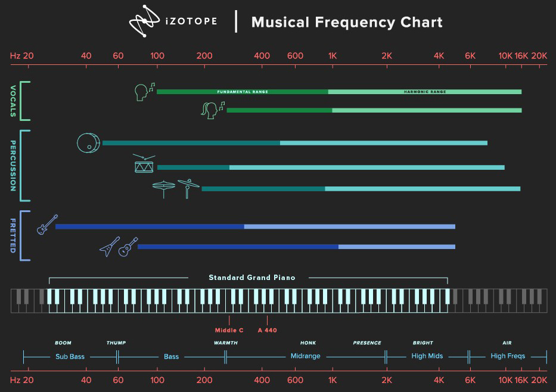

    

# Recording Techniques

#### Altering Sound

- [Distortion](#distortion)
- [Compression](#compression)
- [EQ](#eq)
- [Reverb](#reverb)

#### Instruments

- [Drums](#drums)
- [Vocals](#vocals)

#### Techniques

- [Time Alignment](#time-alignment)
- [Creating Depth](#creating-depth)
- [Cool Tricks](#cool-tricks)
- [General Tips](#general-tips)

#### Output

- [Mastering](#mastering)
- [Live Sound](#live-sound)

# Distortion

- __Distortion from playback__ - Even once the music is released, distortion can occur at the listener’s end. Distortion can happen due to
  - playback method: such as through an analog amplifier
  - algorithm: such as on a streaming site
  - broadcast: such as compression applied during radio broadcasting
- __[Bitcrushing](https://youtu.be/84h64lTd8k0?si=2R6m7HdPGxBWk7mf)__ - Distortion created by reducing the bit depth of a sound.
- __[Downsampling](https://youtu.be/hRhVb6iRArg?si=cj8SaAHlRy1650oL)__ - To intentionally reduce the sample rate of a piece of audio.

#### Distorting instruments

- __Drums__ - distortion can flatten the dynamic range of drums. Ensure that the dynamics of your drums still sound natural, particularly if you’re using distortion together with compression.
- __Sub-bass__ - sub-basses below 80Hz that sound great on studio and club systems can often become lost on speakers with no sub-bass range, such as phones or small Bluetooth speakers. Distorting basslines can give them presence in the frequency range that smaller speakers can reproduce.

# Compression

#### General tips

- __Reasons to use a compressor__
  - To control the sound
  - To reinforce the attack, or make the sound smoother
  - To bring out the ambience or nuances of the sound
  - To make the sound more aggressive
- __Transient__ - a transient is a high amplitude, short-duration sound at the beginning of a waveform. Compression only lowers the volume of transients, since they are the loudest part of a sound.
- __Gain reduction amount__ - aim for max 1 to 2 decibels.
- __Knobs__ - The `Threshold` and `Ratio` parameters control the level of gain reduction applied by the compressor, while `Attack` and `Release` control the timing of how this occurs.
  - __Threshold__ - the intensity of the signal at which the compressor starts compressing. Anything above the `Threshold` level will be compressed.
    - __Peak vs Root Mean Square (RMS)__ define how the compressor listens for peaks above the Threshold. `Peak` has the compressor respond to short peaks in a signal, while `RMS` is more subtle as it averages the intensity of a sound over a period of time. RMS is more tolerant of sudden peaks in intensity.
  - __Ratio__ - Ratio is the extent to which you want the compressor to reduce the intensity of anything above the level set by your Threshold. For example, if you have a signal 6dB above the threshold, a 3:1 Ratio will reduce it by 4dB, making it just 2dB above the threshold. A `Limiter` is when the Ratio is ∞:1. If using a limiter, make sure it's the last effect applied to the sound.
  - __Attack__ - time it takes for compressor to start compressing. A slower attack time lets the sound introduce itself before being shaped by the compressor.
  - __Release__ - time it takes for compressor to stop compressing. Can try to fit this timing to the rhythm of the song. Some compressors have `Auto Release`, which decides the release time for you.
  - __Make-up gain__ - Compressing peaks lowers the signals volume. `Make-up gain` is a volume knob that raises it back up. `Auto gain` is an option on some compressors to do this automatically.
- __Multiband compression__ lets you apply different compression settings to different frequency bands. This prevents one frequency band from triggering compression on all frequency bands.

#### Top-down vs Bottom-up Compression

- __Top-down compression__ - using max compression to notice what it does, then removing some compression until we find a likeable sound.
- __Bottom-up compression__ - starting with no compression, then adding some compression to hear what happens.

#### __Typical Compression Settings__

| Instrument      | Attack (ms) | Release (ms) | Ratio             |
|-----------------|-------------|--------------|-------------------|
| Voice           | 10-100      | 500-1000     | 2:1 to 4:1        |
| Electric Guitar | 20-50       | 1000-2000    | 4:1 to ∞:1        |
| Acoustic Guitar | 100-400     | 100-400      | 2:1 to 4:1        |
| Strings         | 40-50       | 100-200      | 2:1 to 3:1        |
| Drums           | 10-50       | 10-50        | 2:1 to 4:1        |
| Piano           | 100-300     | 50-300       | 2:1 to 4:1        |
| Bass            | 15-50       | 100-300      | 4:1               |

#### __Compressing Vocals__

- __May need different compressor settings for verse and chorus__ since choruses may be louder.

#### Compressing Drums

- __Drums have fast and loud transients__
- __Don't compress too much__ since the original transients of the drum kit will be lost.
- __Can compress the drums as a whole__ rather than working too much on the separate drum tracks

#### Compressing All Instruments Together

- __The kick-drum and snare most likely trigger the compressor__ They are usually the loudest and punchiest elements in a mix.
- __Compressing the Master Bus is optional__. During mastering, compressing and limiting may be added.

# EQ

#### Types of filters

- __Shelves__
  - __High Shelf__ - Evenly increases or decreases the volume of sounds above a selected frequency.
  - __Low Shelf__ - Evenly increases or decreases the volume of sounds below a selected frequency.
- __Filters__
  - __High-pass filter (HPF)__ - Eliminates _low_ frequencies.
  - __Low-pass filter (LPF)__ - Eliminates _high_ frequencies.
- __Bell filter__ - lets you adjust the volume of a specific frequency range in isolation.
- __Notch filter__ - (also called a _band-stop_ filter) allows you to eliminate a specific frequency.

#### Low frequencies

- __Very few speakers can produce sounds below 30 Hz__
- __Remove everything below 40 Hz__ (assuming you have no sub-bass). In this range, there's nothing except rumbling from heating, ventilation, traffic, etc. It might not be audible, but it still uses up precious dynamic space.
- __Frequencies below 100 Hz__ - Only kick-drum and bass should be here. A high-pass filter should be used on other tracks (guitars, keyboards, vocals, etc.) to ensure they stay out of this zone. There shouldn't be reverb under 100Hz either.
- __Balancing kick-drum with sub-bass (under 80 Hz)__. Decide which instrument will occupy each of these two frequency bands. For the mix to sound right, one should occupy each frequency band. If you choose for your sub bass to occupy the sub-bass area, your kick will sound like it sits on top of your sub bass. This is more common in genres like Dubstep or Drum and Bass. If you choose for your kick to occupy the sub bass area, your sub bass will have a harmonic presence, but will have less chest-rattling energy on a big club system - however, your kick will sound powerful. This is more common in genres like Techno. Or use sidechain (explained later).

#### High frequencies

- __3000 - 4000 Hz__ - Our ears are most sensitive in this range. If you want to make an instrument stand out, boost it here. Cut conflicting instruments in the same range for an even more pronounced effect.
- __7000 to 20000 Hz__ - High frequency instruments: cymbals, shakers, tambourines.

#### Using EQ

- __Listen using multiple types of speakers__ - headphones, small speakers, big speakers.
- __Subtractive EQ__ - find the frequencies that annoy you and make them quieter. One way to do this is by using a bell-shaped EQ band up to about 10dB to sweep across the entire frequency range to boost volume, to see if any frequencies sound bad. If so, cut the frequency by 1 to 10dB until the harsh sound disappears.
- __Boosting EQ__ - don't boost the same frequency for too many instruments.
- __Low vs high frequencies__ - Headroom is the room we have before sound clips. Low frequencies take up more headroom than high frequencies. The more low-end in a mix, the less loud your mix can be.
- __Alter EQ in context of your mix__ - your changes won't be heard in isolation. Make EQ changes while all other instrument tracks are playing.
- __How do you know if instruments are in conflict?__ Distortion, typically a fuzzy sound caused by too much amplitude at a particular frequency range.
- __[Tilt EQ](images/tilt_EQ.png)__ - a particular EQ style available on some plugins. The idea behind tilt is that using the usual filter can interfere with the timbre of a well-balanced sound. For example, attenuating a certain frequency of a piano can make it sound less like a piano. The answer to this is tilt. Tilt is a filter type that allows you to 'tilt' the frequency range around a pivot.
- __Don't EQ vocals much__ - our ears are familiar with how a vocal should sound, so keep adjustments subtle.

# Reverb

#### Main knobs

- `Pre-delay` is the time between the original direct sound, and the start of the early reflections.
- `Decay` is the amount of time the reverb lasts.
- `Density` is how tightly packed the individual reflections are.

## Reverb: Sound theory

#### Air

- __Air dampens high frequencies more than low frequencies__ as it transmits sound waves. Natural reverb lacks in high frequencies.

#### Room surface

- __When sound waves encounter a surface__ three things will happen to different extents:
  1. Transmission - some of the sound waves move through the object.
  2. Reflection - some of the sound waves bounce off the object, creating echoes.
  3. Absorption - some of the sound waves get 'trapped' by the object itself, where their energy is transformed into a small amount of heat.
- __Absorptive materials__
  - __Thick fiberglass board__ is consistently absorptive regardless of frequency
  - __Carpet__ is moderately absorptive at higher frequencies, but not at all absorptive at lower frequencies.
- __Effect on `pre-delay`__ - no effect.
- __Effect on `decay`__ - sound decays faster since materials absorb the sound.
- __Effect on `density`__ - no effect.

#### Room size - large

- __Higher `pre-delay`__ - the larger the space, the longer the time it takes for sound to travel to the reflective boundaries (such as the walls of a room) and back to the listener. These early reflections are also quieter.
- __Higher `decay`__ since there's less materials in the space to absorb the sound
- __Lower `density`__ of reflections, since walls are further. Will be more of a delay/echo.

#### Distance of sound source

- __Closer sounds are drier__ - Even in a reflective environment, a sound directly in front of you will naturally be drier than one occurring farther away. This is because the closer you are to the source, the more of the direct sound you hear in comparison with the reverberated sound.

## Reverb: Applying it

#### Types of reverb

- __Room reverbs__ have prominent early reflections (low `pre-delay`) and a short `decay`. When used delicately, they maintain a sense of intimacy. They sound fairly dry due to the short decay time.
- __Hall reverbs__ simulate concert halls. Slow early reflections (low `pre-delay`), but longer reverb time (`decay`), and fairly even frequency distribution. Just like in concert halls, hall reverbs can slightly blur the sound, creating overlaps between notes. Often used for orchestral music, choirs, or pads.
- __[Chamber reverbs](https://youtu.be/Am0ELIQcCgQ?si=vIvY-4iiU7a8vlPd)__ simulates reverb chambers and/or echo rooms built into old music studios in the 1970s. They are a useful all-around reverb and are designed for clarity.
- __[Spring reverb](https://youtu.be/tU7U-U-n4EQ?si=UnT_Kb85_ZH_wleg)__ simulates a physical spring reverb device that literally uses springs to create reverb. It has a prominent twanging sound. Often used on percussive hits or synthesizer stabs.
- __[Plate reverb](https://youtu.be/u6eZ_JbmBDw?si=njdGmenV2pd167MK)__ simulates the physical plate reverb used in the studio in the 1980s. The plate reverb are large encased 4' by 6' sheets. They have a bright attack, and a warm/dark decay, as higher frequencies decay before the lower ones. When pushed, they can create a distinctive twang. The reflection `density` in this preset stays the same throughout the reverb.

#### General Tips

- __Choosing a reverb__ - Choose a reverb based on the venue you expect the sound to be in.
  - Punk band: use room reverb
  - Orchestras: use chamber reverb
- __Common `pre-delay` times__ in milliseconds
  -  20: small room in a home
  -  60: church
  - 120: concert hall
  - 200: small arena
  - 250: large arena
- __Common `decay` times__ in seconds
  - 0.5: small room in a home
  - 1.0: church
  - 1.5: concert hall
  - 2.0: small arena
  - 2.5: large arena
- __Relation between `pre-delay` and `decay`__.
  - They generally grow with the size of the room, so they should either be both low or both high.
  - Low `pre-delay`, high `decay`. This can happen in a long tunnel, or near a wall in a large room. In both cases, the first reflection will come back quickly, while the size of the room guarantees a long reverb time.
- __Group similar instruments__ - Instruments of a similar category should occupy similar spaces. Can send instruments of comparable sonic character to a single aux channel (and maybe add a short reverb)
  - __Bus channel__ - a sum of mixer tracks sent to a channel. Each track has 100% of its output sent to the bus channel.
  - __Aux channel__ - a combination of mixer tracks sent to a channel. Each track can have 0 to 100% of its output sent to the auxiliary channel.
  - __Aux vs Bus__ - busses can be used to control a group of tracks simultaneously. Auxes can be used to send variable signals to monitors in a live setting.
- __Frequencies to reverb__
  - don't add reverb to kick-drum or bass.
  - don't add reverb to low frequencies (below 50 Hz or below 250 Hz). They create a muddy sound.
  - don't add reverb to very high frequencies (above 7000 Hz).
  - don't allow unwanted frequencies into a reverb: to add reverb, copy the sound to a new channel, remove the lows and highs, then add reverb.
- __Adding effects to reverb__ - can optionally experiment adding chorus or distortion to the reverb.
- __Slow songs can have more reverb__ - In general, slower songs or instrument sounds tend to be able to accommodate longer reverb tails compared to faster ones, since the notes won't blur into each other.

#### Troubleshooting

- __Transients aren't clear?__ add more `pre-delay`.
- __Notes blurring into each other?__ lower the `decay` time to preserve the distinction between notes. Try to make the tail of the reverb only last until the next hit/note. Can set decay time to 1/4 of a bar.

#### Reverb for Vocals

- __Use longer `pre-delay`__ so the reverb sits slightly distinct from the vocal. This will normally be around 25-100ms.
- __Use shorter `decay`__ to keep the vocalist's articulation of the lyrics intact, such as one between 0.5 and 1.5 seconds.
- __Use side-chain compression__ on reverb channel, so when vocal plays, the reverb automatically reduces in volume, allowing the vocal to sound clearer.
- __Start with reverb, then turn it off__ - In [Beatles - Day in the Life](https://youtu.be/usNsCeOV4GM?si=q5OT1aNStkOKnxbo), the vocals have reverb until 2:20. Then when the lyrics place the vocalist in a bedroom, the reverb is suddenly removed.
- __Dry (no-reverb) vocals__ feel more intimate and confessional.
- __Reverb for lead vs background singers__ - a drier reverb for lead singer brings the singer closer (into the spotlight), while a wet reverb pushes background singers further away

# Drums

- __Have a live drummer play to a click__ - it’s much easier to splice and realign drum hits to your DAW’s tempo grid if the drummer recorded to a click track.

## Drum Programming

#### General tips

- __Tune the drums__ - tune drum sounds to match key of the song. To help tune, you can pitch shift the kick drum 2 octaves up before tuning it, to better hear the exact note it produces.

#### To add realism

- Subtly vary
  - volume (also known as velocity)
  - pitch
  - attack
  - decay
  - timing
- Randomize above note parameters, using software _humanizing algorithms_.

#### To add variety

- Snare
  - can be replaced with hand-clap, finger-snap, whip, cross-stick, rim-shot, wood block, tom-tom, conga, bell, or pipe. Can use one of these sounds in a verse, and a different sound in a chorus.
- Kick drum
  - pitch-shift kick notes into a melody.
  - use different kick drum sounds for verse and chorus.
- Hi-hat
  - Use various sounds: hi-hat pedal, closed hi-hat, open hi-hat, 1/4th open hi-hat.
- Dynamics
  - try extreme variations.
  - use silence instead of a drum fill.

# Vocals

- __Controlling singer's dynamics__ - Can tell singer to "sing like you're literally singing into somebody's ear". This helps prevent the singer from getting too loud on high notes.
- __Adding clarity to vocals__ - 3 options:
  1. Go through entire song and add volume to lyrics that are hard to hear. Useful on consonants, especially softly sung fricatives after a vowel, like in the word `does`.
  2. Boost vocal volume in 2000 - 5000 kHz range.
  3. Lower competing instrument volume in 2000 - 5000 kHz range.
- __Use de-esser to remove sibilance__ - A sibilant is a form of consonant that has an `ess` sound, which can sometimes prominently hiss. This includes `s`, `z`, `sh`, `zh`, and possibly `ch`. A _de-esser_ plugin finds the frequencies where these `ess` sounds are occurring and lowers the volume at those frequencies.
- __Use pitch correction with care__ - Listen carefully and apply pitch correction only to notes that feel wrong. Can use _Melodyne_ or _Autotune_ software.

# Time Alignment

- __Aim to get other instruments reasonably locked in with the drums__, particularly on the 1st and 3rd beat (in 4/4 time).
- __Don't grid-align intentional lazy grooves__ - a rhythm section sometimes intentionally plays behind the beat. For example, a guitarist may intentionally strum a little after the downbeat every time. Don't change this if it sounds good.
- __Don't grid-align swung grooves__ - Grooves, especially jazz grooves, sometimes have a delayed upbeat, which means the music is swung. Don't re-align it to a perfect grid.

# Creating Depth

- __Depth__ is the sensation that some sounds are further away, while others are closer to the listener.

### Sound Distance

- Distant sounds
  1. __Arrive at listener later__ since sound travels at 343 meters/second.
  2. __Lack high frequencies__ since air removes high frequencies more than low frequencies.
  3. __Are at a lower volume__ - this is so obvious that many tend to forget that volume is a great way to underline depth. If the distance doubles, the volume goes down by 6dB.
  4. __Have more reverb/delay__ since we hear less direct sound and more reflected sound.
  5. __Have imperfections in pitch and time__ due to air molecules (I think)
- To simulate depth, artificially create `1`, `2`, `3`, `4`, `5` from above
  - shift the signal's starting point slightly
  - add EQ to remove the high frequencies
  - lower the volume
  - add reverb or delay
  - add chorus effect (or similar pitch/time modulation effects)

### Panning

- __Pan is short for panorama__ and refers to whether we perceive sounds as coming from the left or right.
- __Why pan?__ - Assuming stereo output, panning creates instrument separation.
- __Don't pan bass sounds__ - bass-heavy sound sources are generally more difficult to locate and are perceived as coming from the center even if they aren't there.
- __Locations to pan__
  - Center
    - Drums (especially kick-drum and snare)
    - Bass instruments
    - Lead Vocal
    - Solo instruments
  - Left/Right
    - Rhythm guitar
    - Rhythm keyboards
    - Background vocals (especially if more than 1)
- __Don't pan 100% left or right__. It sounds unnatural, especially on headphones. In real life, a sound to your left still gets heard by your right ear (a little bit later in time after your left ear)
- __Create left-right balance__. If panning an instrument left, pan another instrument right. Look at volume meters to ensure balance. Can pan rhythm guitar left, and keyboard pads right.
- __Creative panning__
  - __Instrument panned one side, reverb (or delay) panned opposite side__ - can be used on guitars & pianos.
  - __Dynamically pan the reverb__ - Have guitar & reverb panned to same side, then move the reverb slowly from 1 side to another. The listener might feel that something is happening in the sound field but might not know exactly what it is.

# Cool Tricks

- __Sidechain__ is the use of an external signal to trigger an effects device such as a compressor or gate.
  - A setup where Signal A affects Signal B, usually making the Signal B intentionally less audible.
  - __Examples__
    - A radio DJ's voice lowers the volume of a track when he's speaking
    - A kick-drum sidechain (temporarily) lowers bass volume on every hit
    - A vocal sidechain lowers guitar volume when vocalist sings
- __Dynamic focus__ - as the song progresses, you can shift the focus point around the mix, focusing the listener's ears on which parts of the music should stand out at different moments. This can be done by adjusting volume (or compression), tweaking tone (or EQ), adding effects, or panning. It's like saying, "Listen to this, focus here, now here" as you manipulate the sonic environment. This highlights some elements and pushes others to the background.
- __Haas effect__ is adding a small delay between left and right channels, creating a wide stereo sound. Can be done with any stereo plugin.
- __Micro pitch shifting__ is the _haas effect_ (explained above) combined with pitch shifting each side (left and right) to the opposite directions (up and down). It's useful for melodic instruments and vocals, providing a pleasant detuned character. Can be done by hand, or with a plugin.
- __Add chorus effect to background instruments__ such as background vocals, strings, pads, and rhythm guitars.
- __Cross-fade 2 tracks__ - Fade one track out, while fading another track in.

# General Tips

- __Use a reference song__ - it's a great way to reset your ears during mixing. Our ears get accustomed very quickly to what we’re listening to, whether it sounds good or bad. This can mean getting comfortable with heavy bass, over-bright guitars, or poor sounding drums.
- __Listen to your mix at different volume levels__
  - _barely audible_ - you will instantly hear which elements dominate the mix in volume, and in a good mix every important element should be audible at a very low level.
  - _comfortable listening level_
  - _very loud_ - listen for instruments that might actually "hurt" your ears a little bit while listening. If you spot any, lower their volume.
- __Use a spectrum analyzer__ This visually shows the volume of each frequency, revealing possible frequencies that are too loud or soft.    
  - especially useful for low frequencies if you don't have giant subwoofers.
  - if any frequencies are lacking, can add EQ or new instruments to fill the gaps.
- __Macro-mixing approach__ - a non-standard approach. Focus on 'macro' before 'micro'. Treat groups of similar instruments with EQ, compression, effects, etc., before working on individual tracks
- __Use Automation__ - to automate means to perform a parameter adjustment that usually varies over time. The most common parameter to automate is a track’s volume level, but also includes, panning, mute, equalization, and effect plugin. It's done manually, but is then 'automatic' during playback.

# Mastering

- __Mastering is__ editing the stereo out. You don't have access to individual tracks.
- __Can add reverb in mastering__ to put the mix in a shared room. Affects all tracks as a whole.
- __Peak volume levels__
  - -6dB: Intro/Interlude
  - -3dB: Verse
  -  0dB (close to it): Chorus/Solo

# Live Sound

- __Every sound system has 3 parts:__
  1. Input
  2. Mixing
  3. Output

#### Equipment

- __Dynamic vs Condenser Microphone__
  - __Dynamic microphones__
    - __don't need batteries__ - just connect them to a sound system with a cable.
    - __use a diaphragm and magnets to make sound__ - when sound enters the microphone, a diaphragm inside moves back and forth due to the sound waves. Magnets are used to create a low voltage electrical signal which is sent to the mixer.
    - __are built rugged__ - they can be dropped and still work.
  - __Condenser microphones__
    - __need a power source to make sound__ - either a battery, or power from a mixer (labeled "phantom power")
    - __use a diaphragm and 2 electrical plates to make sound__ - Built into condenser microphones are 2 electrically charged plates (which need battery or mixer power). The microphone’s diaphragm movements result in fluctuations in the electrical charge between the plates. This creates an electrical signal which is sent to the mixer.
    - __are able to pick up finer nuances in sound__ as compared to dynamic microphones.
- __XLR Cables are great at reducing noise__ since they have 3 pins (two for audio, one for neutral/ground). They can be much longer than guitar cables (which are 1/4-inch cables) while limiting noise.
- __Speakers__
  - __Front of House Speakers__ are the main speakers connected to the mixer's main outputs.
  - __Monitor Speakers__ are pointed to performers on stage so they can hear themselves better. They are implemented as auxiliary buses on the mixer so that volumes of each instrument can be adjusted, without affecting the Front-of-House speakers.
  - __Sub-bass (20 Hz to 80Hz) can be felt physically in the chest__ assuming large speakers.

#### Mixer

- __Gain knobs on mixer__ - sometimes called 'Trim'.
  - One for each channel.
  - Controls input volume _into_ the mixer.
  - The incoming signal should be at the _nominal level_ (between -12dB and -20dB, mentioned in mixer's owner's manual)
    - If too low: more noise, since we have to increase it's output volume
    - If too high: sound distorts/clips
    - Aim for the _average_ incoming signal (not the maximum) to match the mixer's nominal level.
- __Faders on mixer__
  - One for each channel.
  - Controls output volume.
  - Set each fader to "Unity Gain" initially. This gives sufficient room to then raise or decrease the volume using each channel's fader.
- __Panning__
  - __Use less panning live than on a recording__ since people on the sides of the room are much closer to one speaker than another, unable to equally hear both speakers.
  - __Pan to match performers positions on stage__ - if panning the keyboardist to a side, pan left/right depending on where the performer is on the stage.
- __Can use compression to control dynamics__ - useful on drum set.

#### Sound Check

- __Set up a microphone at the mixer__ to be able to talk to the musicians onstage.
- __4-step sound check__
  1. __Technical checks__ - check if equipment is working properly.
  2. __Gain setting and Basic Processing__ - adjust input of each instrument to mixer's nominal level. Add effects if necessary (initial compression, EQ, reverb)
  3. __Monitor Mix__ - adjust singer's monitor, then adjust monitors for rest of band.
  4. __House Mix__ - have band play together. Adjust the mix.
- __Undesired sounds__
  1. Distortion - happens when an audio input signal is too strong for the sound system to handle.
  2. Noise - anything other than the desired audio signal.
  3. Frequency loss - one scenario is microphones placed too close together, canceling each other out due to phase.
